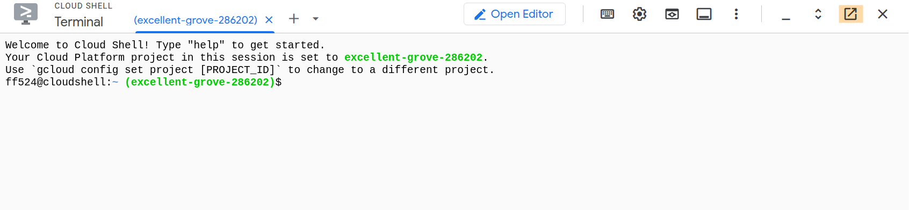
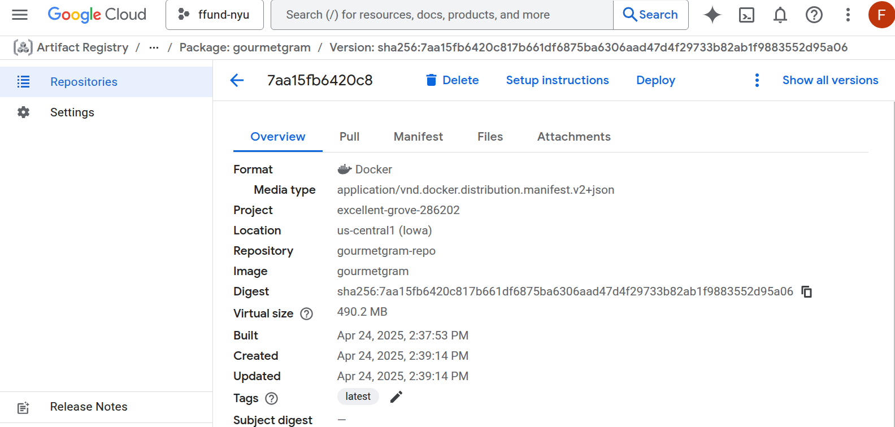

## GourmetGram on Google Cloud Platform

We've spent a lot of time training, serving, and evaluating a hypothetical machine learning service called GourmetGram on Chameleon Cloud. In this experiment, we see how some of those activities might translate to a commercial cloud: Google Cloud (although similar principles would apply to other commercial clouds).

These instructions assume that you have already redeemed education credits on Google Cloud.

---

### Create a GCP project

First, open the Google Cloud console in a web browser: [Google Cloud Console](https://console.cloud.google.com/)

We might need to create a new project for this lab. Click on the project selector in the menu bar at the top of the screen, just to the right of the "Google Cloud" logo (it's highlighted green in the image below).

In the project selector dialog:

1. Click **New Project**
2. Set the **Project name** to `gourmetgram-gcp-lab`
3. For **Organization**, select the organization associated with your education credits (e.g. `nyu.edu`)
4. For **Location** (parent folder), select the appropriate folder under your organization — this may be a folder assigned to your course or your personal folder
5. Click **Create**

Once the project is created, make sure it is selected as the active project using the project selector in the menu bar.

> **Important:** If you previously had a Google Cloud account with a credit card attached to it, make sure you are working in this new project that bills your education credits, not your personal credit card, to avoid being charged for your work.

Next, link your education billing account to this project. Go to [Billing](https://console.cloud.google.com/billing) and make sure your `gourmetgram-gcp-lab` project is associated with the billing account that has your education credits. You should be able to see your education credits in the 'Credits' section of the billing account.

### Open Cloud Shell

When working on Chameleon, we often used either a notebook or a terminal in the "Chameleon Jupyter environment" to provision resources. In this environment, we were already authenticated to the cloud provider. Similarly, on Google Cloud, we will open a terminal in which we are already authenticated, and then we can use this terminal to provision resources and perform basic interactions with the cloud provider. This terminal is called "Cloud Shell" in GPC.

To open the Cloud Shell, click on the terminal icon in the menu - highlighted in pink in the image below.


You will be asked to authorize the Cloud Shell. Then, Google Cloud will provision a VM and connect it to a browser-based terminal that you can use to interact with the service. It may take a few minutes the first time, or after some period of inactivity.

You can use the button highlighted in orange to bring the shell into its browser window, which may be more convenient.



Inside the Cloud Shell, first configure it to use your project and set the `GCP_PROJECT_ID` environment variable, which we will use throughout this tutorial:

```
# run in Cloud Shell
gcloud config set project gourmetgram-gcp-lab
export GCP_PROJECT_ID="gourmetgram-gcp-lab"
```

Verify it's set correctly:

```
# run in Cloud Shell
gcloud config get project
```

This should print `gourmetgram-gcp-lab`.

### Enable APIs

To enable all required APIs for our workflow on Google Cloud Shell, run the following which covers various services across Kubernetes, Cloud Run, Vertex AI, Cloud Storage, Compute Engine, Cloud Build, and Monitoring:

```
# run in Cloud Shell
gcloud services enable \
  compute.googleapis.com \
  container.googleapis.com \
  run.googleapis.com \
  artifactregistry.googleapis.com \
  cloudbuild.googleapis.com \
  storage.googleapis.com \
  notebooks.googleapis.com \
  aiplatform.googleapis.com \
  monitoring.googleapis.com \
  logging.googleapis.com \
  eventarc.googleapis.com \
  cloudscheduler.googleapis.com
```

> **Note:** If you encounter IAM or permission errors at any point during this lab, run `gcloud auth login` in Cloud Shell to re-authenticate and refresh your credentials.

```
# run in Cloud Shell
gcloud auth login
```

Follow the link to authenticate, then come back to Cloud Shell.

### Create a container image

We're going to explore a few different ways to host the GourmetGram service on GCP! But first, we'll create a container image for this service. We'll host the container image inside Google's Artifact Registry.

In your Cloud Shell:

```
# run in Cloud Shell

# 1. Clone the lab repo and move into the app directory
git clone https://github.com/anshsarkar/gourmetgram-gcp-lab.git
cd gourmetgram-gcp-lab/gourmetgram

# 2. Set environment variables - used in the rest of these commands
export REGION="us-central1"
export REPO_NAME="gourmetgram-repo"
export IMAGE_NAME="gourmetgram"

# 3. Create Artifact Registry repo
gcloud artifacts repositories create $REPO_NAME \
    --repository-format=docker \
    --location=$REGION

# 4. Configure Docker to use gcloud credentials
gcloud auth configure-docker $REGION-docker.pkg.dev

# 5. Build Docker image using your existing Dockerfile
docker build -t $REGION-docker.pkg.dev/$GCP_PROJECT_ID/$REPO_NAME/$IMAGE_NAME .

# 6. Push Docker image to Artifact Registry
docker push $REGION-docker.pkg.dev/$GCP_PROJECT_ID/$REPO_NAME/$IMAGE_NAME

# 7. List images to verify successful push
gcloud artifacts docker images list $REGION-docker.pkg.dev/$GCP_PROJECT_ID/$REPO_NAME
```

Now, if you open Artifact Registry in the Google Cloud Console web UI: [Artifact Registry](https://console.cloud.google.com/artifacts)

* you should see a "gourmetgram-repo" repository
* and inside it, a container image named "gourmetgram"
* and you can look at the latest version of this image to see more details



### Cloud Build

In the previous step, we manually ran `docker build` and `docker push` from Cloud Shell to create and upload our container image. This works, but it depends on having Docker available locally and running the commands by hand each time. Google Cloud Build lets you offload the build to Google's infrastructure — you submit your source code and a build config, and Cloud Build builds the image and pushes it to Artifact Registry for you.

The repo includes a `cloudbuild.yaml` that defines the build steps. We'll submit it using `gcloud builds submit`.

First, make sure you are in the `gourmetgram` directory:

```
# run in Cloud Shell
cd ~/gourmetgram-gcp-lab/gourmetgram
```

The repo already includes a `cloudbuild.yaml` in the `gourmetgram` directory. You can view it:

```
# run in Cloud Shell
cat cloudbuild.yaml
```

It defines a single build step that builds the Docker image and pushes it to Artifact Registry. The `substitutions` block provides default values for the region, repo name, and image name — Cloud Build runs remotely and cannot access your local shell variables, so these are passed as build-time substitutions instead.

> **Note:** Cloud Build can build and push images, but it does not create the Artifact Registry repository itself. We already created it in the "Create a container image" step earlier — Cloud Build pushes to that existing repository.

Now submit the build:

```
# run in Cloud Shell
gcloud builds submit --config=cloudbuild.yaml .
```

This will upload your source code to Cloud Build, build the Docker image remotely, and push it to Artifact Registry. You'll see the build logs streaming in your terminal.

You can also view the build in the Google Cloud Console web UI: [Cloud Build](https://console.cloud.google.com/cloud-build/builds)

Once the build completes, verify the new image is in Artifact Registry:

```
# run in Cloud Shell
gcloud artifacts docker images list $REGION-docker.pkg.dev/$GCP_PROJECT_ID/$REPO_NAME
```

You should see a new image with a recent timestamp — this one was built by Cloud Build, not by running Docker commands in Cloud Shell.

### Launch a Kubernetes cluster

We had previously learned how to *manually* deploy a self-managed Kubernetes cluster, which takes quite a lot of time! Commercial cloud providers may offer Kubernetes as a managed service, which is much easier and faster to launch and operate.

GCP's managed Kubernetes service is Google Kubernetes Engine (GKE). In your Cloud Shell, let's launch a Kubernetes cluster using GKE.

Note that the Kubernetes manifest we will apply references the container image we created in the previous step, which is hosted in Artifact Registry.

```
# run in Cloud Shell

# 1. Set environment variables
export REGION="us-central1"
export REPO_NAME="gourmetgram-repo"
export IMAGE_NAME="gourmetgram"
export CLUSTER_NAME="gourmetgram-cluster"
export DEPLOYMENT_NAME="gourmetgram-deployment"
export SERVICE_NAME="gourmetgram-service"

# 2. Create GKE Autopilot Cluster
gcloud container clusters create-auto $CLUSTER_NAME --region=$REGION
gcloud container clusters get-credentials $CLUSTER_NAME --region $REGION
```

It will take a few minutes to launch the cluster. Once the cluster is launched, you can deploy the GourmetGram service, and set up autoscaling of pods on the cluster:

```
# run in Cloud Shell

# 3. Create Kubernetes Deployment & Service YAML
cd
cat > gourmetgram-deployment.yaml <<EOF
apiVersion: apps/v1
kind: Deployment
metadata:
  name: gourmetgram-deployment
spec:
  replicas: 2
  selector:
    matchLabels:
      app: gourmetgram
  template:
    metadata:
      labels:
        app: gourmetgram
    spec:
      containers:
      - name: gourmetgram
        image: $REGION-docker.pkg.dev/$GCP_PROJECT_ID/$REPO_NAME/$IMAGE_NAME
        ports:
        - containerPort: 8000
        resources:
          limits:
            memory: "2Gi"
            cpu: "1"
          requests:
            memory: "1Gi"
            cpu: "500m"
        livenessProbe:
          httpGet:
            path: /test
            port: 8000
          initialDelaySeconds: 10
          periodSeconds: 30
        readinessProbe:
          httpGet:
            path: /test
            port: 8000
          initialDelaySeconds: 5
          periodSeconds: 10
---
apiVersion: v1
kind: Service
metadata:
  name: $SERVICE_NAME
spec:
  type: LoadBalancer
  selector:
    app: gourmetgram
  ports:
    - protocol: TCP
      port: 80
      targetPort: 8000
EOF

# 4. Apply Deployment & Service
kubectl apply -f gourmetgram-deployment.yaml

# 5. Set up Horizontal Pod Autoscaler
kubectl autoscale deployment $DEPLOYMENT_NAME --cpu-percent=50 --min=1 --max=5

# 6. Get External IP (wait and re-run this, until an IP is assigned)
kubectl get service $SERVICE_NAME
```

Initially, it will show the "EXTERNAL-IP" as pending:

```
NAME                  TYPE           CLUSTER-IP       EXTERNAL-IP   PORT(S)        AGE
gourmetgram-service   LoadBalancer   34.118.225.132   <pending>     80:31515/TCP   1s
```

you can re-run

```
# run in Cloud Shell
kubectl get service $SERVICE_NAME
```

until an external IP is assigned.

Use

```
# run in Cloud Shell
kubectl get all
```

to see when your pods are Running and have a `1/1` in the READY column. Since we set `replicas: 2` in the deployment, you should see 2 pods reach `1/1` READY. This may take a few minutes — pods might initially show errors or restarts while the nodes spin up, which is normal for GKE Autopilot. Just wait and re-run the command until all pods are ready.

Then, you can access the service at

```
http://A.B.C.D
```

where you substitute the external IP in place of `A.B.C.D`.

You can check on your cluster using the Google Cloud Console web UI: [Kubernetes Engine](https://console.cloud.google.com/kubernetes)

Click on the "Observability" tab to see some basic information about your cluster.

### Serverless

For a service that is always on, with variable and potentially high load, a Kubernetes cluster might be the best choice. However, if you have a lightweight service that is used intermittently, you might prefer to run it as a serverless instance. The commercial cloud provider manages the logistics of bringing up an active instance when it is needed, and letting it go when it is not.

We will deploy GourmetGram using Google Cloud Run, which is a serverless offering from Google Cloud.

(These instructions assume you have already defined the environment variables in the previous steps!)

Before deploying, make sure your Cloud Shell is authenticated. If you see an error about no active account, run:

```
# run in Cloud Shell
gcloud auth login
```

Follow the link to authenticate, then come back to Cloud Shell. Now deploy:

```
# run in Cloud Shell

# 1. Deploy to Cloud Run
gcloud run deploy $SERVICE_NAME \
  --image $REGION-docker.pkg.dev/$GCP_PROJECT_ID/$REPO_NAME/$IMAGE_NAME \
  --platform managed \
  --region $REGION \
  --allow-unauthenticated \
  --port 8000 \
  --memory=2Gi \
  --timeout=600

# 2. Get the deployed service URL
gcloud run services describe $SERVICE_NAME --region $REGION --format 'value(status.url)'
```

Note that we are using the container image we created in an earlier step, which is hosted in Artifact Registry.

Open the GourmetGram service using the URL printed in the terminal by the last step, and test it.

You can see your Cloud Run service in the Google Cloud Console web UI: [Cloud Run](https://console.cloud.google.com/run)

Click on the "Metrics" tab; this will show you the number of active instances running for your service over time. You can change the time scale from "Last 1 day" to a shorter time scale.

As you generate traffic against your service, you will see the "Container instance count" scale up the number of active containers. However, when your service is idle for a while, it will scale down again.

### Synthetic traffic and scaling

So far we've deployed GourmetGram on both a managed Kubernetes cluster and as a serverless Cloud Run service. Now, let's simulate real-world traffic to see how these services scale — and in the process, collect data that we can use later for retraining the model.

First, make sure your environment variables are still set (if your Cloud Shell session restarted, you will need to re-export these):

```
# run in Cloud Shell
export GCP_PROJECT_ID="gourmetgram-gcp-lab"
export REGION="us-central1"
export REPO_NAME="gourmetgram-repo"
export IMAGE_NAME="gourmetgram"
export SERVICE_NAME="gourmetgram-service"
export CLUSTER_NAME="gourmetgram-cluster"
export DEPLOYMENT_NAME="gourmetgram-deployment"

# Re-fetch GKE credentials (needed if Cloud Shell session restarted)
gcloud container clusters get-credentials $CLUSTER_NAME --region $REGION
```

#### Always-on VM (baseline for cost comparison)

Before we start generating traffic, let's deploy GourmetGram on a plain Compute Engine VM. We won't send traffic to it — its purpose is to run idle throughout the rest of the lab so we can compare its cost against the serverless and autoscaling alternatives later.

```
# run in Cloud Shell
gcloud compute firewall-rules create allow-gourmetgram-vm \
  --allow=tcp:8000 \
  --target-tags=gourmetgram-vm

gcloud compute instances create-with-container gourmetgram-vm \
  --zone=us-central1-a \
  --machine-type=e2-medium \
  --container-image=$REGION-docker.pkg.dev/$GCP_PROJECT_ID/$REPO_NAME/$IMAGE_NAME \
  --tags=gourmetgram-vm
```

This creates a VM running Container-Optimized OS with the GourmetGram container. Once it's ready, get its external IP:

```
# run in Cloud Shell
gcloud compute instances describe gourmetgram-vm \
  --zone=us-central1-a \
  --format='value(networkInterfaces[0].accessConfigs[0].natIP)'
```

Visit `http://<VM_EXTERNAL_IP>:8000` in your browser to verify it's serving, then leave it running. We won't send synthetic traffic to the VM — unlike Cloud Run or GKE with autoscaling, a VM costs the same whether it's handling requests or sitting idle. That's the point: we'll compare its steady cost against the pay-per-use alternatives at the end of this section.

You can see your VM instance in the Google Cloud Console: [Compute Engine](https://console.cloud.google.com/compute/instances)

#### Set up data collection

Set your NYU Net ID and the staging bucket name — the Net ID ensures your bucket name is unique across GCP:

```
# run in Cloud Shell
export NET_ID="your-net-id"
export GCS_STAGING_BUCKET="${NET_ID}-staging-bucket"
```

Create the staging bucket:

```
# run in Cloud Shell
gcloud storage buckets create gs://$GCS_STAGING_BUCKET \
    --location=us-central1 \
    --uniform-bucket-level-access
```

You can verify the bucket was created in the Google Cloud Console: [Cloud Storage](https://console.cloud.google.com/storage/browser)

Now run the setup script included in the lab repo. This will download the Food-11 dataset and organize the images into class directories (`class_00/` through `class_10/`):

```
# run in Cloud Shell
cd ~/gourmetgram-gcp-lab
bash data_generator/setup_data.sh
```

Next, redeploy the GourmetGram service on Cloud Run with the staging bucket configured. This tells the service to save a copy of every incoming image to Cloud Storage as it classifies it:

```
# run in Cloud Shell
gcloud run deploy $SERVICE_NAME \
  --image $REGION-docker.pkg.dev/$GCP_PROJECT_ID/$REPO_NAME/$IMAGE_NAME \
  --platform managed \
  --region $REGION \
  --allow-unauthenticated \
  --port 8000 \
  --memory=2Gi \
  --timeout=600 \
  --set-env-vars="GCS_STAGING_BUCKET=$GCS_STAGING_BUCKET"
```

Now let's generate some traffic! Install the traffic generator's dependencies and run it against the Cloud Run service:

```
# run in Cloud Shell
export SERVICE_URL=$(gcloud run services describe $SERVICE_NAME --region $REGION --format 'value(status.url)')
pip install -r data_generator/requirements.txt
python data_generator/generate_traffic.py --mode predict
```

The `--mode predict` flag sends base64-encoded food images to the `/api/predict` endpoint. The service classifies each image and saves a copy to the GCS staging bucket — this is how we collect "production" data for retraining later. The generator sends 3 bursts with 60-second pauses between them. The first two bursts send 200 images sequentially. The final burst sends 800 images concurrently (20 parallel workers) — this spike in concurrent requests is what forces Cloud Run to scale up multiple instances.

While it runs, check the Cloud Run metrics in the console — you should see the instance count scale up during bursts and back down during pauses: [Cloud Run](https://console.cloud.google.com/run)

> **Note:** The generator also supports `--mode load`, which hits the lightweight `/test` endpoint with GET requests instead of sending images. This generates CPU load without collecting data to GCS — we'll use this mode later when comparing GKE scaling behavior.

After the generator finishes, check the staging bucket for the captured images:

```
# run in Cloud Shell
gsutil ls gs://$GCS_STAGING_BUCKET/incoming/
```

You should see class directories (`class_00/` through `class_10/`) containing the images the service classified. These are organized by the model's predicted class — simulating how production data would accumulate over time as real users interact with the service. You can also browse the bucket contents in the Google Cloud Console: [Cloud Storage](https://console.cloud.google.com/storage/browser)

#### GKE scaling comparison: static vs autoscaling

Earlier in the lab, we deployed GourmetGram on GKE with a Horizontal Pod Autoscaler (HPA) that scales pods between 1 and 5 based on CPU usage. Now let's create a second deployment in the same cluster with a **fixed** number of replicas and no autoscaler, so we can compare how each handles the same traffic.

Create the static deployment:

```
# run in Cloud Shell
cd
cat > gourmetgram-static-deployment.yaml <<EOF
apiVersion: apps/v1
kind: Deployment
metadata:
  name: gourmetgram-static-deployment
spec:
  replicas: 2
  selector:
    matchLabels:
      app: gourmetgram-static
  template:
    metadata:
      labels:
        app: gourmetgram-static
    spec:
      containers:
      - name: gourmetgram
        image: $REGION-docker.pkg.dev/$GCP_PROJECT_ID/$REPO_NAME/$IMAGE_NAME
        ports:
        - containerPort: 8000
        resources:
          limits:
            memory: "2Gi"
            cpu: "1"
          requests:
            memory: "1Gi"
            cpu: "500m"
        livenessProbe:
          httpGet:
            path: /test
            port: 8000
          initialDelaySeconds: 10
          periodSeconds: 30
        readinessProbe:
          httpGet:
            path: /test
            port: 8000
          initialDelaySeconds: 5
          periodSeconds: 10
---
apiVersion: v1
kind: Service
metadata:
  name: gourmetgram-static-service
spec:
  type: LoadBalancer
  selector:
    app: gourmetgram-static
  ports:
    - protocol: TCP
      port: 80
      targetPort: 8000
EOF

kubectl apply -f gourmetgram-static-deployment.yaml
```

Wait for the pods to be ready and the external IP to be assigned:

```
# run in Cloud Shell
kubectl get pods -l app=gourmetgram-static
kubectl get service gourmetgram-static-service
```

You should see 2 pods running. Note the external IP — this is the static deployment. Now let's also get the HPA deployment's external IP:

```
# run in Cloud Shell
kubectl get service gourmetgram-service
```

Now send traffic to both and compare. First, the **HPA deployment** — watch the pods scale up:

```
# run in Cloud Shell
export SERVICE_URL=http://$(kubectl get service gourmetgram-service -o jsonpath='{.status.loadBalancer.ingress[0].ip}')
cd gourmetgram-gcp-lab/
python data_generator/generate_traffic.py --mode load
```

While the generator runs, open a second Cloud Shell tab and watch the HPA in action:

```
# run in second Cloud Shell tab
kubectl get hpa --watch
```

You should see the CPU utilization rise and the replica count increase beyond the initial value. After the bursts finish and the pause begins, the replicas will gradually scale back down.

You can also observe this in the Google Cloud Console: [Kubernetes Engine — Workloads](https://console.cloud.google.com/kubernetes/workload). Click on `gourmetgram-deployment` and check the "Observability" tab to see CPU usage and pod count over time.

Next, the **static deployment** — same traffic, but no autoscaler:

```
# run in Cloud Shell
export SERVICE_URL=http://$(kubectl get service gourmetgram-static-service -o jsonpath='{.status.loadBalancer.ingress[0].ip}')
python data_generator/generate_traffic.py --mode load
```

Watch the static pods:

```
# run in second Cloud Shell tab
kubectl get pods -l app=gourmetgram-static --watch
```

The pod count stays fixed at 2 regardless of load. Under heavy traffic, the existing pods absorb all the requests — there is no scaling. Compare this with what you observed for the HPA deployment, where new pods were created automatically to handle the burst.

We now have three scaling behaviors to compare:
- **VM:** always on, no scaling at all — same cost idle or busy
- **GKE static:** fixed pods, no scaling — pods may get overwhelmed under load
- **GKE HPA:** pods scale up with load, scale back down after
- **Cloud Run:** scales to zero between bursts, scales up during bursts — you only pay for what you use

You can select each service in this [report](https://console.cloud.google.com/billing/01274B-82C9D1-885CD6/reports;timeRange=CUSTOM_RANGE;from=2026-03-28;to=2026-03-31;projects=gourmetgram-gcp-lab;products=services%2F152E-C115-5142?authuser=1&project=gourmetgram-gcp-lab&organizationId=213239977032) to see the cost incurred by each one during this experiment. But you will mostly not be able to see a cost difference yet as it takes some time for the costs to be calculated and reflected in the billing console. You can check back later to see the cost breakdown.

#### Event-driven inference with Eventarc

In the previous steps, the traffic generator called the Cloud Run service directly — a synchronous, request-response pattern. Now let's see an alternative: an **event-driven** architecture where uploading an image to Cloud Storage automatically triggers inference, with no direct API call.

The flow: generator uploads images to a GCS bucket → Eventarc detects the new files → Cloud Run is triggered to classify each image → results are saved to the staging bucket.

This pattern decouples data ingestion from processing — the generator just writes files, and inference happens independently. In production, this is useful when data arrives from many sources (mobile uploads, IoT devices, batch imports) and you want a single processing pipeline regardless of how the data gets there.

First, create a separate bucket for Eventarc uploads:

```
# run in Cloud Shell
export GCS_EVENTARC_BUCKET="${NET_ID}-eventarc-bucket"
gcloud storage buckets create gs://$GCS_EVENTARC_BUCKET \
    --location=us-central1 \
    --uniform-bucket-level-access
```

Set up the required permissions. Eventarc needs the Cloud Storage service agent to publish events, and a service account to invoke Cloud Run:

```
# run in Cloud Shell
PROJECT_NUMBER=$(gcloud projects describe $GCP_PROJECT_ID --format='value(projectNumber)')

# Ensure the GCS service agent exists
gcloud storage service-agent --project=$GCP_PROJECT_ID

# Grant the GCS service agent permission to publish Pub/Sub messages (required for Eventarc)
GCS_SERVICE_AGENT="service-${PROJECT_NUMBER}@gs-project-accounts.iam.gserviceaccount.com"
gcloud projects add-iam-policy-binding $GCP_PROJECT_ID --member="serviceAccount:${GCS_SERVICE_AGENT}" --role="roles/pubsub.publisher"

# Grant the default compute service account permission to invoke Cloud Run
COMPUTE_SA="${PROJECT_NUMBER}-compute@developer.gserviceaccount.com"
gcloud run services add-iam-policy-binding $SERVICE_NAME --region=$REGION --member="serviceAccount:${COMPUTE_SA}" --role="roles/run.invoker"

# Create the Eventarc service agent (must exist before granting roles)
gcloud beta services identity create --service eventarc.googleapis.com --project $GCP_PROJECT_ID

# Grant the Eventarc service agent its required role
gcloud projects add-iam-policy-binding $GCP_PROJECT_ID --member="serviceAccount:service-${PROJECT_NUMBER}@gcp-sa-eventarc.iam.gserviceaccount.com" --role="roles/eventarc.serviceAgent"
```

Now create the Eventarc trigger. This watches for new objects in the eventarc bucket and sends the event to our Cloud Run service's `/event` endpoint:

```
# run in Cloud Shell
gcloud eventarc triggers create gourmetgram-eventarc-trigger \
  --location=$REGION \
  --destination-run-service=$SERVICE_NAME \
  --destination-run-region=$REGION \
  --destination-run-path="/event" \
  --event-filters="type=google.cloud.storage.object.v1.finalized" \
  --event-filters="bucket=${GCS_EVENTARC_BUCKET}" \
  --service-account="${COMPUTE_SA}"
```

It may take a minute or two for the trigger to become fully active. You can check its status:

```
# run in Cloud Shell
gcloud eventarc triggers describe gourmetgram-eventarc-trigger --location=$REGION --format='value(transport.pubsub.subscription)'
```

If this returns a subscription name (e.g. `projects/gourmetgram-gcp-lab/subscriptions/...`), the trigger is ready. If it returns empty, wait and try again.

Now let's test it. The upload mode uses the `google-cloud-storage` Python library, which needs application default credentials. Set those up first:

```
# run in Cloud Shell
gcloud auth application-default login
```

Follow the link to authenticate, then run the generator in `upload` mode:

```
# run in Cloud Shell
export GCS_UPLOAD_BUCKET=$GCS_EVENTARC_BUCKET
python data_generator/generate_traffic.py --mode upload
```

The generator uploads images to `gs://<eventarc-bucket>/uploads/`. Each upload triggers Eventarc, which invokes the Cloud Run service. The service downloads the image, classifies it, and saves the result to the staging bucket under `incoming/class_XX/`.

While it runs, you can watch the Cloud Run logs to see the event-driven invocations (if running this in a new Cloud Shell tab, make sure `SERVICE_NAME` is set). Because this is a new Cloud sheel session you also will have to run `gcloud auth login` to authenticate before you can see the logs.:

```
# run in Cloud Shell
export SERVICE_NAME="gourmetgram-service"
gcloud logging read "resource.type=cloud_run_revision AND resource.labels.service_name=$SERVICE_NAME AND textPayload:Eventarc" \
  --limit=20 --format="value(textPayload)"
```

After the generator finishes, check the staging bucket — you should see new images that were classified via the Eventarc pipeline:

```
# run in Cloud Shell
gsutil ls gs://$GCS_STAGING_BUCKET/incoming/ | head -20
```

Notice that the result is the same as Option A (direct API) — classified images organized by predicted class in the staging bucket. The difference is architectural: the generator never called the service directly. It just uploaded files, and Eventarc handled the rest.

You can browse the staging bucket to see the newly classified images: [Cloud Storage](https://console.cloud.google.com/storage/browser). You can also check the Cloud Run metrics to see that inference requests were triggered by Eventarc — look at the request count and instance count in the "Metrics" tab: [Cloud Run](https://console.cloud.google.com/run)

> **Note:** The upload mode is slower than the direct API mode since each image goes through GCS first, then Eventarc, then Cloud Run. You can interrupt the generator with `Ctrl+C` once you've confirmed the flow works — the goal here is to see event-driven scaling in action, not to wait for all 1200 uploads to complete.

#### Cost comparison

We've now seen four deployment models handle the same workload. Here's a summary of what we observed:

| Deployment | Traffic | Saves to GCS | Scaling behavior |
|---|---|---|---|
| **VM** | None (idle) | No | Always on — same cost idle or busy |
| **GKE static** | `--mode load` | No | Fixed pods — no scaling under load |
| **GKE HPA** | `--mode load` | No | Pods scale up with load, back down after |
| **Cloud Run** | `--mode predict` | Yes | Scales to zero between bursts, scales up during |
| **Cloud Run (Eventarc)** | `--mode upload` | Yes (via trigger) | Same as Cloud Run — event-driven scaling |

You can check the cost difference in the Google Cloud Console: [Billing](https://console.cloud.google.com/billing)

> **Key takeaway:** The VM and static GKE cluster cost the same whether they're serving traffic or sitting idle. HPA improves pod efficiency but the cluster still runs. Cloud Run charges only for actual request processing time — for bursty or intermittent workloads, this can be significantly cheaper.

## Batch data for training

In the previous section, our Cloud Run service classified incoming images and saved them to the staging bucket under `incoming/class_XX/`. This is raw production data — it needs to be organized into a versioned training dataset before we can use it for model training.

In a production ML system, new data arrives continuously. Rather than retraining on the entire dataset every time, we use **incremental learning**: each batch of new data becomes a new version, and the model fine-tunes on just the new data, carrying forward knowledge from previous training through its weights.

Our batch pipeline will:
1. Check the staging bucket for new images in `incoming/`
2. If new data exists, create a versioned folder (`v1`, `v2`, ...) in the training bucket
3. Copy the images, write a metadata file, and clean up the staging bucket
4. If no new data exists, skip — no empty versions are created

First, make sure your environment variables are set (if you're in a new Cloud Shell session or tab).

Set your Net ID (replace `your-net-id` with your actual NYU Net ID):

```
# run in Cloud Shell
export NET_ID="your-net-id"
```

Then set the remaining variables:

```
# run in Cloud Shell
export GCP_PROJECT_ID="gourmetgram-gcp-lab"
export REGION="us-central1"
export REPO_NAME="gourmetgram-repo"
export GCS_STAGING_BUCKET="${NET_ID}-staging-bucket"
export SERVICE_NAME="gourmetgram-service"
export SERVICE_URL=$(gcloud run services describe $SERVICE_NAME --region $REGION --format 'value(status.url)')
PROJECT_NUMBER=$(gcloud projects describe $GCP_PROJECT_ID --format='value(projectNumber)')
COMPUTE_SA="${PROJECT_NUMBER}-compute@developer.gserviceaccount.com"
```

### Create the training bucket

```
# run in Cloud Shell
export GCS_TRAINING_BUCKET="${NET_ID}-training-bucket"
gsutil mb -l $REGION gs://$GCS_TRAINING_BUCKET
```

You can verify the bucket was created in the [Cloud Storage console](https://console.cloud.google.com/storage/browser).

### Build and deploy the batch job

The repo includes a batch data script (`batch_job/batch_data.py`) and a Dockerfile (`batch_job/Dockerfile`). Let's build the container and deploy it as a Cloud Run Job.

Build and push the container using Cloud Build:

```
# run in Cloud Shell
cd ~/gourmetgram-gcp-lab/batch_job
gcloud builds submit --tag $REGION-docker.pkg.dev/$GCP_PROJECT_ID/gourmetgram-repo/batch-data-job
```

Now create the Cloud Run Job:

```
# run in Cloud Shell
gcloud run jobs create batch-data-job \
  --image=$REGION-docker.pkg.dev/$GCP_PROJECT_ID/gourmetgram-repo/batch-data-job \
  --region=$REGION \
  --set-env-vars="GCS_STAGING_BUCKET=$GCS_STAGING_BUCKET,GCS_TRAINING_BUCKET=$GCS_TRAINING_BUCKET"
```

You can see the job in the [Cloud Run Jobs console](https://console.cloud.google.com/run/jobs).

### Run the batch job manually (v1)

The staging bucket already has classified images from the synthetic traffic section. Let's run the batch job to create our first versioned dataset:

```
# run in Cloud Shell
gcloud run jobs execute batch-data-job --region=$REGION --wait
```

The `--wait` flag blocks until the job completes. While it runs, open the [Cloud Run Jobs console](https://console.cloud.google.com/run/jobs) and click on `batch-data-job`. You'll see the execution in progress — click on it to view the **Logs** tab, where you can watch the job scanning the staging bucket, copying images class by class, and writing the version metadata in real time.

Verify the versioned dataset was created:

```
# run in Cloud Shell
gsutil ls gs://$GCS_TRAINING_BUCKET/datasets/Food-11/
```

You should see a `v1/` folder. Check its contents:

```
# run in Cloud Shell
gsutil cat gs://$GCS_TRAINING_BUCKET/datasets/Food-11/v1/metadata.json
```

This metadata file records when the version was created, total image count, and per-class distribution. Browse the dataset in the [Cloud Storage console](https://console.cloud.google.com/storage/browser) to explore the `v1/training/class_XX/` structure.

Also verify that the staging bucket's `incoming/` folder was cleaned up:

```
# run in Cloud Shell
gsutil ls gs://$GCS_STAGING_BUCKET/incoming/
```

This should be empty — the batch job moved all images to the training bucket and cleaned up.

### Schedule the batch job

In production, this batch job would run on a regular schedule (daily, weekly) to automatically version new data as it arrives. Let's set up Cloud Scheduler to demonstrate this pattern.

> **Note:** We're using a 5-minute interval for the lab so you can see it trigger within the session. In production, this would typically be a daily or weekly schedule depending on data volume.

```
# run in Cloud Shell
gcloud scheduler jobs create http batch-data-scheduler \
  --location=$REGION \
  --schedule="*/5 * * * *" \
  --uri="https://$REGION-run.googleapis.com/apis/run.googleapis.com/v1/namespaces/$GCP_PROJECT_ID/jobs/batch-data-job:run" \
  --http-method=POST \
  --oauth-service-account-email=${COMPUTE_SA}
```

You can see the scheduler in the [Cloud Scheduler console](https://console.cloud.google.com/cloudscheduler).

### Generate new production data

Before generating new traffic, wait for the scheduler to fire once (about 5 minutes). Check the [Cloud Scheduler console](https://console.cloud.google.com/cloudscheduler) — once you see the "Last run" column update, click on `batch-data-job` in the [Cloud Run Jobs console](https://console.cloud.google.com/run/jobs) and look at the latest execution logs. You should see:

```
No new images in incoming/. Skipping — no version created.
```

This confirms the batch job correctly skips when there's no new data — it won't create empty versions. Verify that the training bucket still only has v1:

```
# run in Cloud Shell
gsutil ls gs://$GCS_TRAINING_BUCKET/datasets/Food-11/
```

Now let's simulate more production traffic. Run the data generator against the Cloud Run inference service — this will classify new images and save them to the staging bucket:

```
# run in Cloud Shell
cd ~/gourmetgram-gcp-lab
python data_generator/generate_traffic.py --mode predict
```

While this runs, take a moment to think about the production data flywheel:
- Users send images → the model classifies them → classified images accumulate in the staging bucket
- The scheduled batch job periodically versions this data into the training bucket
- Training jobs can then fine-tune the model on new versions, improving it over time

### Verify scheduled v2 creation

After the generator finishes, the staging bucket has new data in `incoming/`. Within 5 minutes, Cloud Scheduler will trigger the batch job automatically.

Check if v2 has been created:

```
# run in Cloud Shell
gsutil ls gs://$GCS_TRAINING_BUCKET/datasets/Food-11/
```

If you only see `v1/`, wait a few minutes for the scheduler to fire. You can check the scheduler's last run time in the [Cloud Scheduler console](https://console.cloud.google.com/cloudscheduler) — look at the "Last run" column.

Once v2 appears, inspect it:

```
# run in Cloud Shell
gsutil cat gs://$GCS_TRAINING_BUCKET/datasets/Food-11/v2/metadata.json
```

You now have two versioned datasets. In the next section (Vertex AI Training), we'll use these versions to train a model — the training job will collate all untrained versions into a single dataset for that training run.

### Pause the scheduler

To avoid the job running repeatedly while you work through the remaining sections, pause the scheduler:

```
# run in Cloud Shell
gcloud scheduler jobs pause batch-data-scheduler --location=$REGION
```

> **Tip:** You can resume it later with `gcloud scheduler jobs resume batch-data-scheduler --location=$REGION` if you want to generate more versions.

## Vertex AI Training

Now that we have versioned datasets, let's train the GourmetGram model using Vertex AI's managed training service. We'll use a **Vertex AI Pipeline** with two stages:

1. **Data Preparation** — Collates all untrained dataset versions (v1, v2) into a single dataset with an 80/20 train/validation split
2. **Model Training** — Trains or fine-tunes MobileNetV2 on the collated data using a GPU

This mirrors a production ML workflow: data arrives in batches (versions), gets collated, and the model is trained on the combined data. If a previously trained model exists, it fine-tunes from those weights. Otherwise, it trains from scratch using a pretrained MobileNetV2 backbone.

The pipeline produces versioned models (`model_v1`, `model_v2`, ...) stored in GCS alongside a `latest/` copy that always points to the most recent model.

### Request GPU quota

Vertex AI Training requires GPU quota. Request an increase **now** since approval can take some time.

1. Go to [IAM & Admin → Quotas](https://console.cloud.google.com/iam-admin/quotas)
2. In the filter bar, search for `Custom model training NVIDIA T4 GPUs per region`
3. Select the quota for `us-central1`
4. Click **Edit Quotas**, set the new limit to `1`, and provide a justification (e.g., "For ML model training in a university lab")
5. Submit the request

> **Note:** Quota increases for T4 GPUs are usually approved within minutes for small requests, but can take up to 24-48 hours. Continue with the setup steps while you wait.

### Set up environment variables

```
# run in Cloud Shell
export GCP_PROJECT_ID="gourmetgram-gcp-lab"
export REGION="us-central1"
export NET_ID="your-net-id"
```

```
# run in Cloud Shell
export GCS_TRAINING_BUCKET="${NET_ID}-training-bucket"
```

### Grant storage access for the training pipeline

The Vertex AI pipeline runs under the compute service account, which needs read/write access to the training bucket:

```
# run in Cloud Shell
PROJECT_NUMBER=$(gcloud projects describe $GCP_PROJECT_ID --format='value(projectNumber)')
COMPUTE_SA="${PROJECT_NUMBER}-compute@developer.gserviceaccount.com"
gsutil iam ch serviceAccount:${COMPUTE_SA}:roles/storage.objectAdmin gs://$GCS_TRAINING_BUCKET
```

### Authenticate for Vertex AI

The pipeline submission requires application default credentials:

```
# run in Cloud Shell
gcloud auth application-default login
```

Follow the link to authenticate.

### Install pipeline dependencies

```
# run in Cloud Shell
cd ~/gourmetgram-gcp-lab
pip install -r training/requirements.txt
```

### Run the training pipeline

The training pipeline is defined in `training/pipeline.py`. It uses the Kubeflow Pipelines SDK to define two components and submits them to Vertex AI:

```
# run in Cloud Shell
cd ~/gourmetgram-gcp-lab/training
python pipeline.py \
  --project=$GCP_PROJECT_ID \
  --region=$REGION \
  --training-bucket=$GCS_TRAINING_BUCKET \
  --pipeline-root=gs://$GCS_TRAINING_BUCKET/pipeline-artifacts
```

This does three things:
1. **Compiles** the pipeline to a YAML template
2. **Uploads** the template to `gs://<training-bucket>/pipeline-templates/` so you can re-run it from the UI later
3. **Submits** the first run to Vertex AI

### Monitor the pipeline

Open the [Vertex AI Pipelines console](https://console.cloud.google.com/vertex-ai/pipelines/runs) to see your pipeline. Click on the run to view the DAG — you'll see the two components and their dependencies:

- **prepare-data** — Collating dataset versions and splitting into train/val
- **train-model** — Training MobileNetV2 with GPU acceleration

Click on each component to view its logs in real time. The training component will show epoch-by-epoch progress:

```
Phase 1: Training classification head (backbone frozen)
Epoch 1/5 | Train Loss: 1.2345 Acc: 0.5678 | Val Loss: 0.9876 Acc: 0.6543 | Time: 12.3s
...
Phase 2: Fine-tuning entire model (backbone unfrozen)
Epoch 6/20 | Train Loss: 0.4567 Acc: 0.8234 | Val Loss: 0.5432 Acc: 0.7890 | Time: 25.1s
...
```

The pipeline typically takes 15-30 minutes depending on the dataset size and GPU availability.

### Verify the trained model

Once the pipeline completes, check the model output:

```
# run in Cloud Shell
gsutil ls gs://$GCS_TRAINING_BUCKET/models/
```

You should see:

```
gs://<training-bucket>/models/latest/
gs://<training-bucket>/models/model_v1/
```

Check the training metadata:

```
# run in Cloud Shell
gsutil cat gs://$GCS_TRAINING_BUCKET/training_metadata.json
```

This shows which data versions were used and the model version produced. You can also browse the model artifacts in the [Cloud Storage console](https://console.cloud.google.com/storage/browser).

> **What happened:** The pipeline collated v1 and v2 into a single dataset, split it 80/20 for training and validation, then trained MobileNetV2 in two phases — first the classification head only (5 epochs), then fine-tuning the entire model with early stopping. The best model was saved as `model_v1` and also copied to `latest/`.

### The full retraining cycle

Let's walk through the complete production data flywheel: new data arrives → batch job versions it → training pipeline produces an updated model.

**Step 1: Generate new production data**

Run the data generator again to simulate new user traffic:

```
# run in Cloud Shell
cd ~/gourmetgram-gcp-lab
python data_generator/generate_traffic.py --mode predict
```

This sends images to the Cloud Run inference service, which classifies them and saves to the staging bucket under `incoming/`.

**Step 2: Run the batch job to create v3**

The scheduler is paused, so trigger the batch job manually:

```
# run in Cloud Shell
gcloud run jobs execute batch-data-job --region=$REGION --wait
```

Verify v3 was created:

```
# run in Cloud Shell
gsutil ls gs://$GCS_TRAINING_BUCKET/datasets/Food-11/
gsutil cat gs://$GCS_TRAINING_BUCKET/datasets/Food-11/v3/metadata.json
```

You should now see `v1/`, `v2/`, and `v3/`. The training metadata still shows `last_trained_version: 2` — v3 hasn't been trained on yet.

**Step 3: Re-run the training pipeline from the UI**

This time, let's trigger the pipeline from the Vertex AI console instead of the CLI:

1. Go to [Vertex AI Pipelines](https://console.cloud.google.com/vertex-ai/pipelines/runs) in the console
2. Click **Create Run**
3. Under "Pipeline template", select **Upload from GCS** and enter: `gs://<your-training-bucket>/pipeline-templates/gourmetgram-training.yaml` (replace `<your-training-bucket>` with your actual bucket name, e.g. `as1234-training-bucket`)
4. Set the **Output directory** to: `gs://<your-training-bucket>/pipeline-artifacts` (e.g. `gs://as1234-training-bucket/pipeline-artifacts`)
5. Set the `project` parameter to your GCP project ID (e.g. `gourmetgram-gcp-lab`)
6. Set the `training_bucket` parameter to your training bucket name (e.g. `as1234-training-bucket`)
7. Leave the other parameters at their defaults (or adjust if you'd like to experiment)
8. Click **Submit**

This time, the pipeline will:
- **prepare-data**: Only collate v3 (since v1 and v2 were already trained on), split into train/val
- **train-model**: Load `model_v1` weights and **fine-tune** on v3 data, producing `model_v2`

Watch the pipeline in the [Vertex AI Pipelines console](https://console.cloud.google.com/vertex-ai/pipelines/runs). In the train-model logs, you should see it loading the previous model:

```
Loading existing model: model_v1 for fine-tuning
```

**Step 4: Verify the new model**

Once the pipeline completes:

```
# run in Cloud Shell
gsutil ls gs://$GCS_TRAINING_BUCKET/models/
gsutil cat gs://$GCS_TRAINING_BUCKET/training_metadata.json
```

You should now see `model_v1/` and `model_v2/`, with the metadata showing `last_trained_version: 3` and `last_model_version: 2`. The `latest/` folder always points to the most recent model.

> **Key takeaway:** This is the production ML flywheel in action — new data arrives, gets versioned, and the model incrementally improves through fine-tuning. Each cycle produces a traceable model version linked to specific data versions. Notice how we triggered this run from the UI instead of the CLI — the pipeline template is stored in GCS and reusable, so anyone on the team can trigger a new training run with different parameters.

## Stage 6: Vertex AI Experiments, TensorBoard & Model Registry

So far our training pipeline produces versioned models, but we have no way to compare training runs, visualize learning curves, or browse registered models in one place. In this stage we add **experiment tracking** — the pipeline will log hyperparameters and per-epoch metrics to **Vertex AI Experiments**, stream training curves to **Vertex AI TensorBoard**, and register each trained model in the **Vertex AI Model Registry**.

The pipeline already has the tracking code built in — it just needs to be activated by passing an experiment name and TensorBoard instance. Without those parameters, the pipeline behaves exactly as before.

First, make sure your environment variables are still set (if your Cloud Shell session restarted, you will need to re-export these):

```
# run in Cloud Shell
export GCP_PROJECT_ID="gourmetgram-gcp-lab"
export REGION="us-central1"
export SERVICE_NAME="gourmetgram-service"

# IMPORTANT: Change this to your Net ID
export NET_ID="your-net-id"

export GCS_TRAINING_BUCKET="${NET_ID}-training-bucket"
export GCS_STAGING_BUCKET="${NET_ID}-staging-bucket"
```

### Create a TensorBoard instance

A TensorBoard instance is a regionalized resource that stores your experiment data. Create one:

```
# run in Cloud Shell
gcloud ai tensorboards create --display-name=gourmetgram-tensorboard --region=$REGION
```

This takes a minute or two. Once it completes, note the resource name printed (it looks like `projects/123/locations/us-central1/tensorboards/456`).

Retrieve the full TensorBoard resource name and save it to an environment variable:

```
# run in Cloud Shell
TENSORBOARD_ID=$(gcloud ai tensorboards list --region=$REGION --format="value(name)" --limit=1)
echo $TENSORBOARD_ID
```

You can view your TensorBoard instance in the console under the **TensorBoard Instances** tab: [Vertex AI Experiments](https://console.cloud.google.com/vertex-ai/experiments)

### Generate new data for a fresh training run

To see experiment tracking in action, let's create a new data version and train on it. If you already have untrained data versions from the previous stage, you can skip ahead to "Run the pipeline with experiment tracking".

```
# run in Cloud Shell
cd ~/gourmetgram-gcp-lab

# Set the Cloud Run service URL and generate new production traffic
export SERVICE_URL=$(gcloud run services describe $SERVICE_NAME --region=$REGION --format="value(status.url)")
python data_generator/generate_traffic.py --mode predict

# Run the batch job to create a new data version
gcloud run jobs execute batch-data-job --region=$REGION --wait

# Verify the new data version was created
gsutil ls gs://$GCS_TRAINING_BUCKET/datasets/Food-11/
```

### Run the pipeline with experiment tracking

Now re-run the pipeline with the `--experiment-name` and `--tensorboard-id` flags to enable tracking:

```
# run in Cloud Shell
cd ~/gourmetgram-gcp-lab/training

python pipeline.py \
  --project=$GCP_PROJECT_ID \
  --region=$REGION \
  --training-bucket=$GCS_TRAINING_BUCKET \
  --pipeline-root=gs://$GCS_TRAINING_BUCKET/pipeline-artifacts \
  --experiment-name=gourmetgram-experiment \
  --tensorboard-id=$TENSORBOARD_ID
```

The pipeline will compile, upload the updated template, and submit the run. With experiment tracking enabled, the training component will:
- Log all hyperparameters (epochs, learning rate, batch size, data versions)
- Log training/validation loss and accuracy at every epoch
- Log summary metrics (best validation loss, model version)
- Register the trained model in Vertex AI Model Registry

Monitor the pipeline in the console: [Vertex AI Pipelines](https://console.cloud.google.com/vertex-ai/pipelines/runs)

### Explore Vertex AI Experiments

Once the pipeline completes, go to the Experiments tab in the console:

[Vertex AI Experiments](https://console.cloud.google.com/vertex-ai/experiments)

1. Click on the **gourmetgram-experiment** experiment
2. You'll see a table of runs (e.g. `train-v1`, `train-v2`, etc.) — each row is one training run
3. Click on a run to see:
   - **Parameters**: hyperparameters used (learning rate, epochs, batch size, data versions)
   - **Metrics**: summary metrics (best validation loss, model version)
   - **Time series**: per-epoch training curves

If you have multiple runs, you can **compare them side by side** by selecting multiple rows and clicking "Compare". This lets you see how different hyperparameters or data versions affected training performance.

### View TensorBoard

Open TensorBoard to visualize training curves. Go to the **TensorBoard Instances** tab in Vertex AI Experiments:

[Vertex AI Experiments](https://console.cloud.google.com/vertex-ai/experiments)

1. Click on the **TensorBoard Instances** tab, then click **gourmetgram-tensorboard**
2. Click **Open TensorBoard**
3. In the TensorBoard UI, you'll see time series charts for:
   - `train_loss` and `val_loss` — the loss curves for each training run
   - `train_acc` and `val_acc` — the accuracy curves for each training run

You can overlay multiple runs to compare how the model improved across training cycles.

### View Model Registry

The pipeline automatically registers each trained model in Vertex AI Model Registry. View your registered models:

[Vertex AI Model Registry](https://console.cloud.google.com/vertex-ai/models)

You should see a model named `gourmetgram-model-v<N>` for each training run that had experiment tracking enabled. Each entry includes:
- The GCS artifact URI pointing to the trained weights
- The serving container image (for future deployment)

### Train a second model with different hyperparameters

To demonstrate experiment comparison and to prepare two model versions for deployment in the next stage, let's run the pipeline again with a different learning rate. The `--retrain` flag tells the pipeline to reuse the same collated data and start from the same base model as the previous run — the only difference is the learning rate, making it a fair comparison.

> **Production vs. Retrain models:** Regular pipeline runs save models to `models/model_vN/` in GCS and update the production model lineage (`training_metadata.json`). Retrain runs (`--retrain`) are for **experimentation only** — the model is saved to a temporary `retrain-artifacts/` path and registered in Model Registry with a `retrain` prefix (e.g., `gourmetgram-retrain-model-v4`). This keeps a clear separation: the `models/` directory contains your production model lineage, while retrain models exist only in Model Registry for canary deployments and experiment comparison.

```
# run in Cloud Shell
cd ~/gourmetgram-gcp-lab/training

python pipeline.py \
  --project=$GCP_PROJECT_ID \
  --region=$REGION \
  --training-bucket=$GCS_TRAINING_BUCKET \
  --pipeline-root=gs://$GCS_TRAINING_BUCKET/pipeline-artifacts \
  --experiment-name=gourmetgram-experiment \
  --tensorboard-id=$TENSORBOARD_ID \
  --retrain \
  --lr=5e-4
```

Once this completes, go back to [Vertex AI Experiments](https://console.cloud.google.com/vertex-ai/experiments) and click on **gourmetgram-experiment**. You should now see two runs side by side — `train-v<N>` (the production run) and `v<N>-retrain-<timestamp>` (the experiment). Both have the same version number because the retrain is an alternative to the same model version, not a new one. Select both and click **Compare** to see how the different learning rates affected training performance.

Check [Model Registry](https://console.cloud.google.com/vertex-ai/models) — you should see two models:
- `gourmetgram-model-v<N>` — the production model (saved in `models/` in GCS, updates production lineage)
- `gourmetgram-v<N>-retrain-<timestamp>` — the experimental model (exists only in Model Registry for canary deployment, does not touch production `models/` directory or metadata)

We'll deploy both in the next stage with traffic splitting to compare their real-world performance.

> **Key takeaway:** Experiment tracking turns your training pipeline from a black box into a fully observable system. Every run is recorded with its hyperparameters, metrics, and model artifacts — making it easy to compare runs, reproduce results, and audit which data/config produced which model. The same pipeline works with or without tracking, controlled by a single parameter.

## Stage 7: Vertex AI Endpoints

So far we've served GourmetGram using Cloud Run and GKE — both are general-purpose hosting platforms. **Vertex AI Endpoints** is purpose-built for ML model serving: it integrates directly with Model Registry, supports **traffic splitting** between model versions (for canary deployments and A/B testing), and provides ML-specific monitoring.

In this stage, we'll deploy our trained models from Model Registry to a Vertex AI Endpoint, then split traffic between two model versions.

### Update the serving container

When Vertex AI Endpoints deploys a model, it mounts the model artifacts from GCS and sets the `AIP_STORAGE_URI` environment variable pointing to them. Our app needs to load the model from this path instead of the bundled file.

The repo includes a `gourmetgram-vertex/` directory with this change already made. The only difference from the original `gourmetgram/` app is in the model loading section of `app.py`:

```python
# Vertex AI Endpoints mount model artifacts and set AIP_STORAGE_URI
# Fall back to bundled model for Cloud Run / GKE deployments
aip_storage = os.environ.get("AIP_STORAGE_URI", "")
if aip_storage:
    model_path = os.path.join(aip_storage, "food11.pth")
    logging.info(f"Loading model from Vertex AI artifact: {model_path}")
else:
    model_path = "food11.pth"
    logging.info("Loading bundled model: food11.pth")
```

When deployed on a Vertex AI Endpoint, it loads the trained model from the artifact URI. When deployed on Cloud Run or GKE (where `AIP_STORAGE_URI` is not set), it falls back to the bundled model — so the same image works everywhere.

### Rebuild the container image

Build and push the updated image using Cloud Build. We use the **same image name** (`gourmetgram`) so the models already registered in Model Registry automatically pick up this updated container:

```
# run in Cloud Shell
cd ~/gourmetgram-gcp-lab/gourmetgram-vertex

gcloud builds submit --tag $REGION-docker.pkg.dev/$GCP_PROJECT_ID/$REPO_NAME/$IMAGE_NAME .
```

> **Note:** This overwrites the previous `gourmetgram` image in Artifact Registry. Existing Cloud Run and GKE deployments are not affected — they continue running the version they were deployed with. Only new deployments will use this updated image.

### Create a Vertex AI Endpoint

Create an endpoint that will serve predictions:

```
# run in Cloud Shell
gcloud ai endpoints create --display-name=gourmetgram-endpoint --region=$REGION
```

Retrieve the endpoint ID:

```
# run in Cloud Shell
ENDPOINT_ID=$(gcloud ai endpoints list --region=$REGION --format="value(name)" --filter="displayName=gourmetgram-endpoint" --limit=1)
echo $ENDPOINT_ID
```

### Deploy a model to the endpoint

First, get the model IDs for the two models we trained in Stage 6:

```
# run in Cloud Shell
gcloud ai models list --region=$REGION --format="table(name, displayName)"
```

You should see a production model (e.g. `gourmetgram-model-v3`) and a retrain/experimental model (e.g. `gourmetgram-v3-retrain-20260331-142300`). Note their full resource names.

Save the model IDs — the production model and the retrain model:

```
# run in Cloud Shell
MODEL_1=$(gcloud ai models list --region=$REGION --format="value(name)" --filter="displayName~gourmetgram-model-v" --sort-by=~createTime --limit=1)
MODEL_2=$(gcloud ai models list --region=$REGION --format="value(name)" --filter="displayName~retrain" --sort-by=~createTime --limit=1)
echo "Production model: $MODEL_1"
echo "Retrain model:    $MODEL_2"
```

Deploy the production model to the endpoint with 100% of traffic:

```
# run in Cloud Shell
gcloud ai endpoints deploy-model $ENDPOINT_ID \
  --model=$MODEL_1 \
  --display-name=production \
  --traffic-split=0=100 \
  --region=$REGION \
  --machine-type=n1-standard-2
```

This takes a few minutes. You can monitor the deployment in the console: [Vertex AI Endpoints](https://console.cloud.google.com/vertex-ai/endpoints)

### Test the endpoint

Once the deployment is ready, send a test prediction:

```
# run in Cloud Shell
ENDPOINT_RESOURCE=$(gcloud ai endpoints list --region=$REGION --format="value(name)" --filter="displayName=gourmetgram-endpoint" --limit=1)

# Encode the test image as base64
BASE64_IMAGE=$(base64 -w 0 ~/gourmetgram-gcp-lab/gourmetgram-vertex/instance/uploads/test_image.jpeg)

# Send a prediction request
curl -X POST \
  -H "Authorization: Bearer $(gcloud auth print-access-token)" \
  -H "Content-Type: application/json" \
  "https://$REGION-aiplatform.googleapis.com/v1/$ENDPOINT_RESOURCE:predict" \
  -d "{\"instances\": [{\"image\": \"$BASE64_IMAGE\"}]}"
```

You should see a prediction response with the food class and confidence score.

### Traffic splitting

Now let's deploy the retrain (experimental) model alongside the production model and split traffic — this is how you'd do a canary rollout in production:

First, get the deployed model ID for the existing deployment:

```
# run in Cloud Shell
DEPLOYED_MODEL_ID=$(gcloud ai endpoints describe $ENDPOINT_ID --region=$REGION --format="json" | python3 -c "import sys,json; print(json.loads(sys.stdin.read())['deployedModels'][0]['id'])")
echo "Deployed model ID: $DEPLOYED_MODEL_ID"
```

Deploy the retrain model with a 70/30 traffic split:

```
# run in Cloud Shell
gcloud ai endpoints deploy-model $ENDPOINT_ID \
  --model=$MODEL_2 \
  --display-name=retrain-canary \
  --traffic-split=0=30,$DEPLOYED_MODEL_ID=70 \
  --region=$REGION \
  --machine-type=n1-standard-2
```

This deploys the retrain model as a canary and splits traffic: 70% goes to the production model, 30% to the experimental retrain model. You can see the traffic split in the console: [Vertex AI Endpoints](https://console.cloud.google.com/vertex-ai/endpoints)

Send multiple prediction requests and observe that responses may come from different model versions:

```
# run in Cloud Shell
for i in $(seq 1 10); do
  curl -s -X POST \
    -H "Authorization: Bearer $(gcloud auth print-access-token)" \
    -H "Content-Type: application/json" \
    "https://$REGION-aiplatform.googleapis.com/v1/$ENDPOINT_RESOURCE:predict" \
    -d "{\"instances\": [{\"image\": \"$BASE64_IMAGE\"}]}" | python3 -c "import sys,json; r=json.loads(sys.stdin.read()); print(f'Request {$i}: {r}')"
done
```

> **Key takeaway:** Vertex AI Endpoints brings ML-specific serving capabilities that general-purpose platforms like Cloud Run don't provide out of the box. Traffic splitting lets you safely roll out new model versions — deploy with 10% traffic, monitor performance, then gradually increase. Combined with Experiment tracking from Stage 6, you have a complete picture: which data and hyperparameters produced which model, and how each model performs in production.
